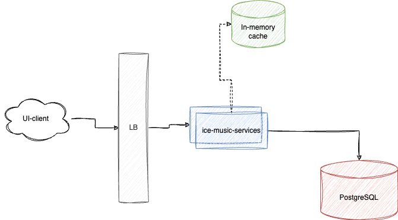
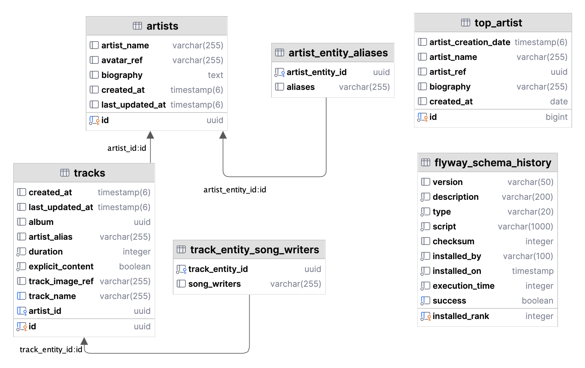

# Music Meta Application

## Problem

Task is to design and implement a Music Metadata Service that stores and provides metadata about different music tracks
and artists. This service should be easy to access and use and be consumable by different kind of interfaces like web
apps and mobile devices. This service should be able to serve millions of users

### Requirements

1. Add A New Track
2. Edit Artist Name
3. Fetch Artist Tracks
4. Artist of the day

## Appetite

- This should take half a day to accomplish

## Running the application

### System Requirements

- Docker
- Java

You can run the application in two ways
1. Gradle: Start the application using the gradle command - 
```
./gradlew runApp
```
This will run the application tests, and then start up the application

2. Docker: You can use the application using the provided docker-compose.yml file in root of the directory, and calling it up as so

```
./gradlew build

# and then... 

docker compose up -d
```

### Accessing the app

1. Initialize Artists: The app comes empty. To load Artists, go to the url to create and retrieve artist
   Ids : http://localhost:8585
2. To use all the APIs, please use this link - http://localhost:8585/swagger-ui.html

## Assumptions & No-gos

### assumptions

1. Application is used only in Berlin timezone, with 2 million active users
2. A well tested and documented set of APIs will suffice
3. There's an existing CI/CD Pipeline

### no-gos

- Working out Artist of the day for different time zones
- Splitting functionality into a microservices architecture
- Implementing a frontend to showcase use of APIs: This will be solved by providing a POSTMAN Scripts along with Swagger
  UI links for documentation

## Solution

For a solution that can be provided in the time specified, some parts will have to be skipped. The approach solving this
issue will be to

1. Include rough estimations for server requirements
2. Include a high-level design of what this application will look like
3. State assumptions taken while implementing the stated requirements
4. Add possible future improvements

### Capacity Estimations

Server capability: 32 hardware threads, with 8GB of RAM ==> 1000 RPS

- Users: 2,000,000
- 1 User requests/day (for tracks/artist of the day) = 150 Requests
- 1 User requests/day (for alias updates) = 2-3 Requests (small)
- Requests for 24hrs = 150 X 2000000 ==> 300,000,000
- Requests/s = 300,000,000 / 86400 = 3472.22 ==> 3500 RPS

At off-peek periods, 3 of such servers can handle the number of incoming requests. But at peek periods, 
we'll need 2000 of such servers to ensure the system holds things together

## High Level Design

<table>
  <tr>
  <th>System Design</th>
  <th>Database</th>
  </tr>
  <tr>
  <td></td>
  <td></td>
  </tr>
</table>

## API Implementation

The application was structured to align with a clean architecture approach, with the domains implemented partly as rich
models and partly as anaemic models

API docs can be accessed via the included POSTMAN Script and also at URL: http://localhost:8585/swagger-ui/index.html

### Edit Artist Name

Artists are designed to have the important fields - artist-ref, biography and aliases, which represents the name(s) of
the artist. To get going, there's a purely utility endpoint to help get a list artist on the system.
The following rules apply

1. Artists names are captured in the list of aliases
2. An artist therefore, will have to have at least one alias, representing his name
3. There's the possibility of selecting a preferred name/alias, which will be used going forward for that artist
4. API for viewing and updating an artist can be found in the attached POSTMAN Collection, and also in Swagger UI

### Add A New Track

Tracks have main fields which include - track name, trackRef, artist and duration. other aspects of the track were
excluded for brevity. Track addition is pretty straight forward with required fields highlighted

### Fetch Artist Tracks

Artist Tracks fetching was as required, with the addition of making the list be paginated so as enable viewing tracks of
artists in a piece-meal approach, and it defaults to 50.

### Artist of the day

To be able to get artists of the day, I've relied on the creation date of the artist as being the driver for retrieving
artists in a cyclic fashion. For the purposes of the assignment, there's the provision to "force" retrieving the next
artist of the day. For this to occur, the system

- requires a parameter to ensure it is forced to return a different artist for the same day
- sets the next artist within the same day, and ensures that subsequent calls always go the latest artist of the day
- resets once the artist number are exhausted
- This means that if new artist is added, it will be showing within the last run of top-artists
- Since this is expected to be viewed many times in a day, the results are cached until a new artist of the day is
  selected to reduce the load on the system

## Improvements

1. UI that can be used to showcase APIs properly
2. Security for accessing the application
3. Artist Registration
4. Provision of a CI/CD pipe to ensure tests pass on being merged to the master (or ideally release/staging |
   release/product) branch
5. Shared
6. Health checks and Monitoring
7. Creation of helm charts for project
